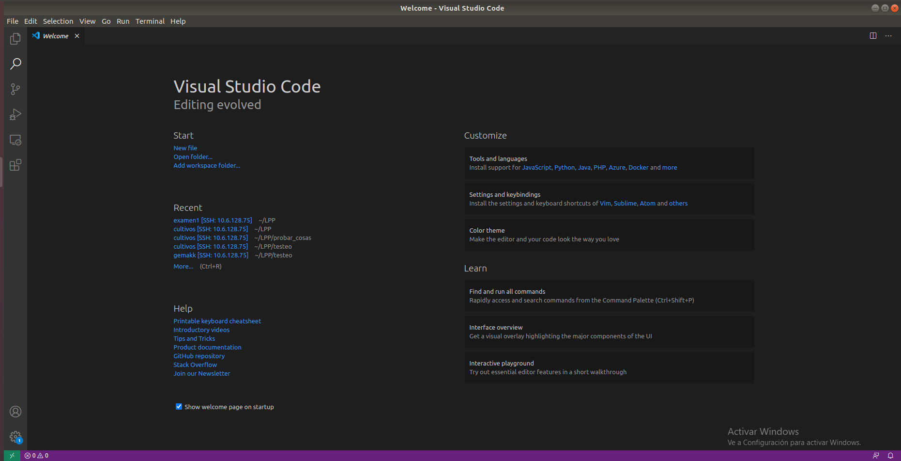
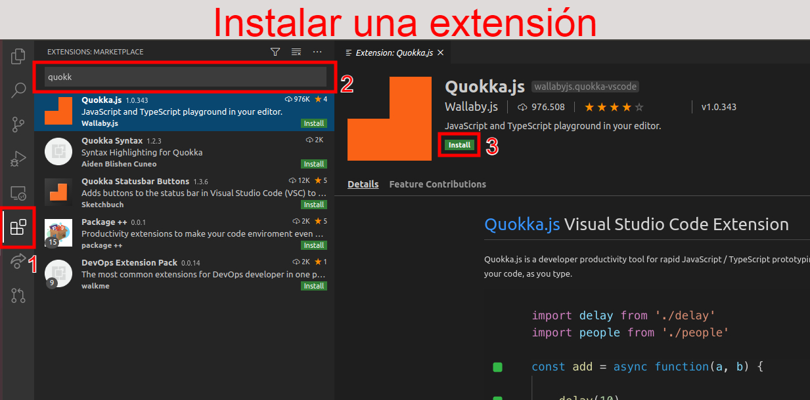
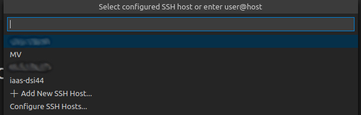
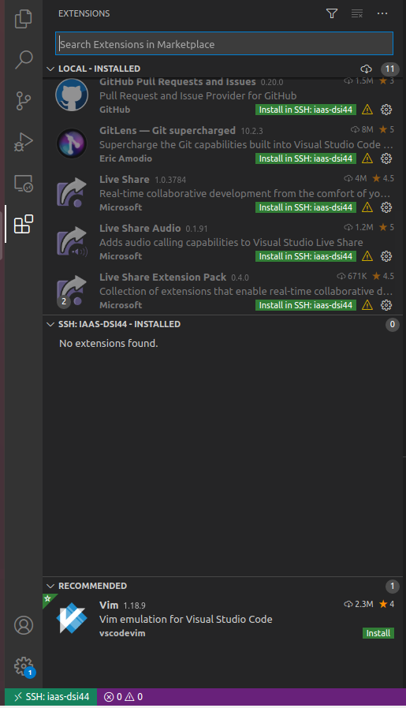
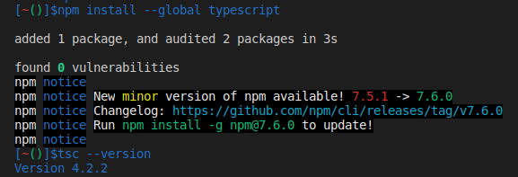
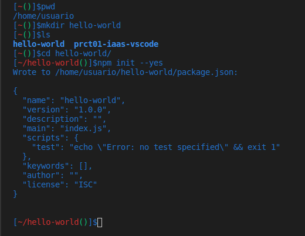
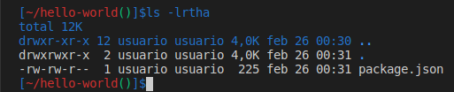
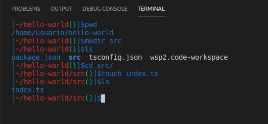
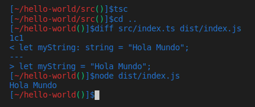

# Práctica 2 - Instalación y configuración de Visual Studio Code
* Elaborado por Eduardo Da Silva Yanes

## Nota aclaratoria
Durante el informe vamos a ver textos e instrucciones que corresponden a comandos de consola. Los comandos que deben ser introducidos en consola van precedidos de **...$** haciendo referencia al prompt. Los comentarios aclarativos tienen, al igual que muchos lenguajes de programación, **//** antes del comentario. Finalmente, si hay un texto sin ninguna de estas cosas debe ser interpretado como eso, un texto, que puede debe ser escrito o leido según corresponda.
```bash
...$ ESTO CORRESPONDE A COMANDOS
// ESTO CORRESPONDE A COMENTARIOS ACLARATIVOS
ESTO CORRESPONDE A TEXTO DE ENTRADA O SALIDA (Depende del contexto)
```

## 1. Introducción
En esta segunda práctica vamos a centrarnos más en el entorno de trabajo. Vamos a configurar el entorno de Visual Studio Code para poder trabajar cómodamente, instalando extensiones y configurando la conexión SSH.
Una vez hecho esto vamos a tener una primera toma de contacto con Typescript creando un "Hola mundo".

## 2. Desarrollo de la práctica

### 2.1 Instalando VS Code
Visual Studio Code es uno de los entornos más populares entre desarrolladores. Lo primero que vamos a hacer es instalarlo en nuestra máquina local.
Si estamos en Windows podemos instalarlo como cualquier otra aplicación, descargando un ejecutable y ejecutandolo.
Si nos encontramos en un entorno Linux, como es nuestro caso, podemos realizar la instalación con los siguientes comandos:
```bash
...$  sudo apt install code
```
o haciendo uso de snap (otro gestor de paquetes)
```bash
...$  sudo snap install code --classic
```



En mi caso particular ya tenía instalado VSCode y lo he usado previamente pero si es la primera vez que tienes contacto con este editor/ide es recomendable que mires algún tutorial o guía para saber cómo son las funcionalidades del programa. En la documentación de VSCode tenemos la sección de **[Manejo básico](https://code.visualstudio.com/docs/editor/codebasics)** donde podemos aprender un poco, a lo largo de varias guías, cómo usar este editor.

### 2.2 Conectándose remotamente usando VS Code
Lo primero que vamos a hacer es descargarnos la extensión [Remote-SSH](https://marketplace.visualstudio.com/items?itemName=ms-vscode-remote.remote-ssh). Gracias a esta extensión podremos conectarnos por SSH a la máquina del IaaS.



Una vez instalada podemos usar directamente la conexión SSH. Vemos que abajo a la izquierda hay un cuadradito verde. Podemos dar click ahí o presionar **F1** para abrir la paleta de comandos y luego buscamos **ssh**. Pulsamos sobre **Connect to host...**. Si hemos realizado todos los pasos de la [Práctica 1]() vemos que nos va a salir nuestra máquina iaas-dsi44. Si por algún motivo no hicimos esos pasos podemos hacer lo siguiente:Vamos a ir a **Configure SSH Hosts...** y elejimos la opción **~/.ssh/config**.
Ahora debemos introducir lo siguiente:
```
Host iaas-dsi44
  HostName iaas-dsi44 //o en lugar de iaas-dsi44 ponemos la ip
  User usuario
```
Recordemos que iaas-dsi44 es mi máquina del IaaS. Cada uno debe poner la que le corresponda.
Una vez hecho esto ya podemos hacer la conexión SSH. Como hemos dicho antes, presionamos en el icono verde de la esquina inferior izquierda o abrimos la paleta de comandos con **F1**, buscamos **ssh** y, en ambos casos, seleccionamos **Connect to host...**, seleccionando el host que acabamos de poner.



Vemos que se nos abre una nueva ventana y en la esquina inferior izquierda vemos como pone que es una conexión ssh con iaas-dsi44. Abrimos una terminal en esta nueva ventana y lo primero que vemos es el característico prompt que configuramos en la práctica anterior pero de todos modos vamos a asegurarnos que estamos en el sitio correcto. Usemos el siguiente comando para verificarlo:
```bash
...$ hostname
iaas-dsi44
```

### 2.3 Instalando más extensiones
Vamos a instalar más extensiones para mejorar nuestra productividad. La primera de todas es **Live Share Extension Pack**. Esta extensión es un pack, como su nombre indica, dedicado a poder colaborar con otros usuarios simultaneamente en nuestro código. Además de poder compartir nuestros ficheros también nos proporciona chat de audio y voz.

Para poder usar esta extensión debemos iniciar sesion con Github o Microsoft (para motivos de identificación en la sesión). Si somos el anfitrión se nos generará un link que debemos compartir con nuestros colaboradores. A la izquierda veremos quienes están conectados, qué se está compartiendo, etc. Si quieremos información más específica podemos obtenerla en el [Marketplace de Live Share Extension Pack](https://marketplace.visualstudio.com/items?itemName=MS-vsliveshare.vsliveshare-pack), en el apartado de **Getting started** o en esta [guia de colaboracion en VS Code](https://code.visualstudio.com/learn/collaboration/live-share). 

Además se nos recomienda instalar las extensiones que tenemos al final de la página de Live Share Extension Pack. Lo primordial para nuestro caso es instalar lo relacionado con el workflow de Github. El resto es a nuestra elección.

Una cosa a tener en cuenta es que, cuando estamos conectados a la máquina por SSH y queremos instalar una extensión, esa extensión se instalará **solo** en la máquina a la que estamos conectados, no en la local. Si queremos instalarlo también en nuestra máquina local debemos desconectarnos, instalarlas y luego conectarnos a la MV por SSH. Una vez conectados podemos activar en el menú de **Extensiones** las que consideremos.



**IMPORTENTE: No recomiendo instalar la extensión Code Time por los conflictos que ocasiona con la conexión SSH**

### 2.4 Nuestro primer "Hola mundo"
Antes de comenzar con el código vamos a instalar la extensión Eslint que nos comprueba el estilo del código de nuestros ficheros js y ts. Como bien nos dice la guia de la extensión, antes de instalarla debemos tener instalado eslint. Ya que esto es algo que vamos a utilizar mucho a lo largo del curso vamos a instalarlo globalmente con la opción:
```bash
...$ npm install -g eslint
```
Vamos a instalar el compilador de Typescript. Para ello haremos:
```bash
...$ npm install --global typescript

// Comprobams que está instalado y vemos la versión
...$ tsc --version
```
Como es de esperar, la opción --global nos permite que el compilador se instale de manera global.



Ahora comprobamos que estemos en nuestro directorio **home** con el comando:
```bash
...$ pwd
```
Creemos una carpeta para nuestro primer proyecto:
```bash
...$ mkdir hello-world
...$ cd hello-world/
```

El siguiente comando nos permite crear un fichero package.json cuya función es, entre otras, establecer las dependencias de desarrollo y ejecución del proyecto a modo de paquetes.
```bash
...$ npm init --yes

// Comprobamos que se ha creado el fichero
...$ ls -lrtha
```





Abrimos nuestro directorio **Hello World** en VS Code. Para ello vamos a la opción **File** en la barra superior, **Open folder...** y abrimos nuestra carpeta.
También podemos crear un workspace si lo deseamos. Para ello vamos de nuevo a **File** pero esta vez seleccionamos **Add Folder to Workspace...**. Si no teniamos ningún workspace previo se nos creará uno nuevo. Guardamos el espacio de trabajo en la opción **Save Workspace As...** y listo, ya podemos empezar a trabajar.

Vamos a crear un fichero tsconfig.json donde indicamos las opciones para el compilador de Typescript. Para ello hacemos:
```bash
...$ touch tsconfig.json
```
Abrimos el fichero y añadimos lo siguiente:
```
{
  "compilerOptions": {
    "target": "ES2018",
    "outDir": "./dist",
    "rootDir": "./src",
    "module": "CommonJS"
  }
}
```
Estas directrices nos indican, por orden, que queremos generar código compatible con los últimos estándares, que el directorio de salida sea dist, que los fichero fuente están en src y por último indicamos un estándar para cargar código desde ficheros independientes.

Ese directorio src no está creado. No existe. Por tanto, vamos a generarlo dentro de nuestra carpeta hello-world:
```bash
...$ mkdir src
...$ cd src
```
Creemos el fichero de nuestro "Hola mundo":
```bash
...$ touch index.ts
...$ ls
```



Abrimos el fichero en el editor y ponemos estas lineas:
```typescript
let myString: string = "Hola Mundo";
console.log(myString);
```
Guardamos y ejecutamos en la terminal el compilador
```bash
...$ tsc
```
Ese comando habrá creado el directorio dist junto a un fichero index.js, tal y como hemos indicado en el fichero de configuración.
Vamos a ver qué diferencias hay entre este fichero js y nuestro código en Typescript.
```bash
...$ diff src/index.ts dist/index.js 
```
Vemos que la diferencia está en la declaración del string. Esto se debe a que Typescript es un lenguaje tipado y este tipo de declaraciones nos permite evitar errores.

Ahora si, veamos si nuestro **Hola mundo** ha funcionado:
```bash
...$ node dist/index.js
```
Si todo ha salido bien deberías ver tu precioso "Hola mundo".



## 3. Dificultades 
A la hora de realizar la práctica hubo un problema general entre los alumnos con las extensiones. En la parte donde se nos recomienda instalar la extensiones recomendadas que encontramos al final del marketplace, una de ellas daba un conflicto con la conexión SSH y continuamente hacía que esta cayera. Entre todos llegamos a la conclusión de que este era el problema ya que fuimos probando, desactivando las extensiones, hasta resolver el problema. Finalmente, indagando en la red hemos visto foros donde también reportan este problema.

## 4. Conclusión
Esta práctica nos permite tener un entorno de desarrollo más óptimo y cómodo, tanto para nosotros como desarrolladores como para colaborar con nuestros compañeros. Conocer esas extenciones puede mejorar nuestra productividad y así poder dedicarle más tiempo a otras cosas más importantes.

Así mismo, la parte de crear nuestro Hola mundo es muy interesante no solo porque ya tenemos todo lo necesario para poder generar nuestro propio código sino porque es la primera toma de contacto y nos permite entender cual es el proceso de compilación y estructura en este lenguaje.

## 5. Referencias
* **[Guión Práctica 2 DSI](https://ull-esit-inf-dsi-2021.github.io/prct02-vscode/)**: Guión de la asignatura donde detalla el desarrollo de la práctica 2.
* **[Guía sobre uso de Live Share](https://code.visualstudio.com/learn/collaboration/live-share)**: Guía con videotutorial sobre cómo usar Live Share.
* **[Aporte de un foro Github](https://github.com/swdotcom/swdc-vscode/issues/246)**: Persona a la que le ocurre lo mismo que nos ocurría a nosotros con Code Time.
